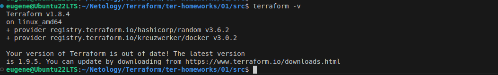
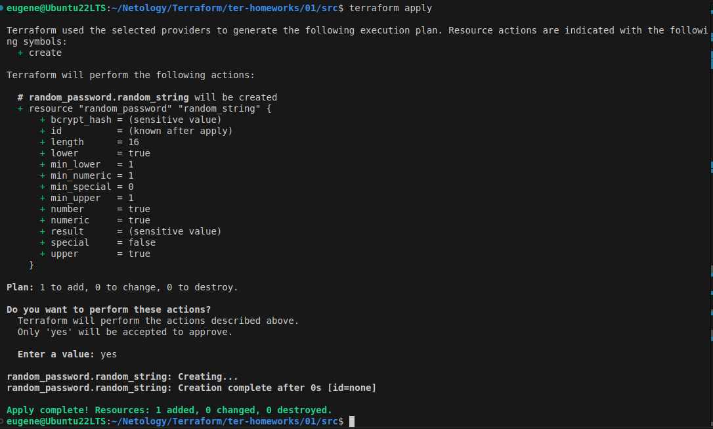
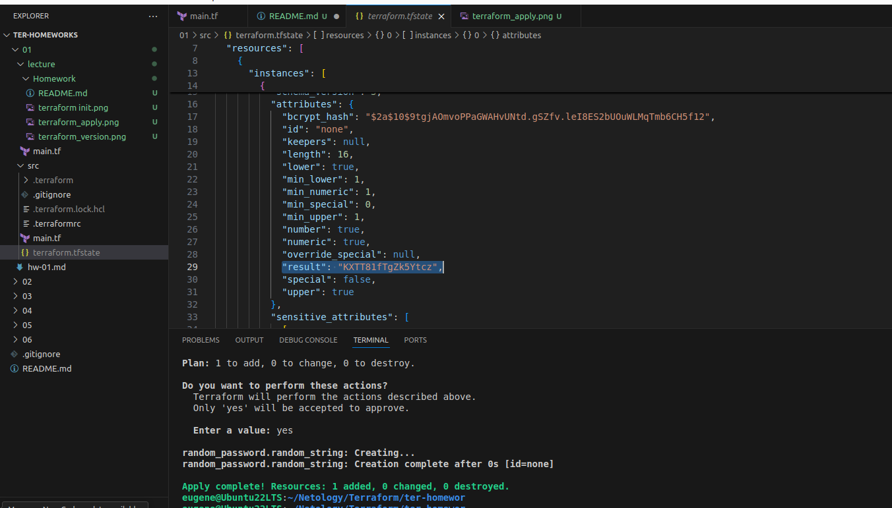
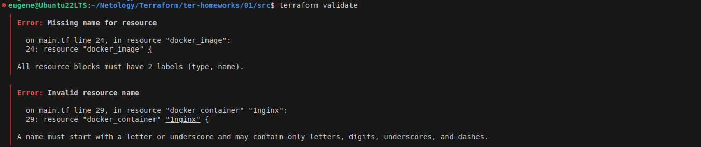
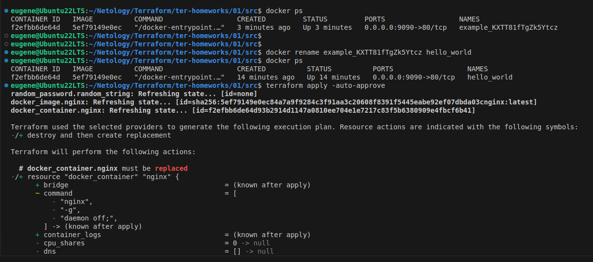
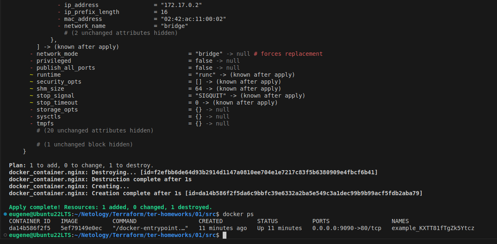
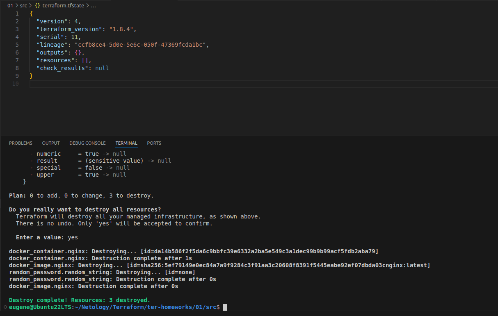

Задание 1

1.Версия Terraform

Перейдите в каталог src. Скачайте все необходимые зависимости, использованные в проекте:

2.Изучите файл .gitignore. В каком terraform-файле, согласно этому .gitignore, допустимо сохранить личную, секретную информацию?(логины,пароли,ключи,токены итд)
------------------------------
# own secret vars store.
personal.auto.tfvars
------------------------------

3.Выполните код проекта.

random_password(length = 16):

4.Три ошибки:

All resource blocks must have 2 labels (type, name).
A name must start with a letter or underscore and may contain only letters, digits, underscores, and dashes.

31:   name  = "example_${random_password.random_string_FAKE.resulT}"

5.Выполните код:

6.Выполните команду terraform apply -auto-approve

Не требуется подтверждения выполнения apply.
You can pass the -auto-approve option to instruct Terraform to apply the plan without asking for confirmation.

Опасность в том, что одновременно несколько человек могут менять код, тогда получится непредсказуемое изменение инфраструктуры.

7.Уничтожте созданные ресурсы с помощью terraform:

8. Объясните, почему при этом не был удалён docker-образ nginx:latest.

resource "docker_image" "nginx"{
  name         = "nginx:latest"
  keep_locally = true

keep_locally  - (Boolean) If true, then the Docker image won't be deleted on destroy operation. If this is false, it will delete the image from the docker local storage on destroy operation.
